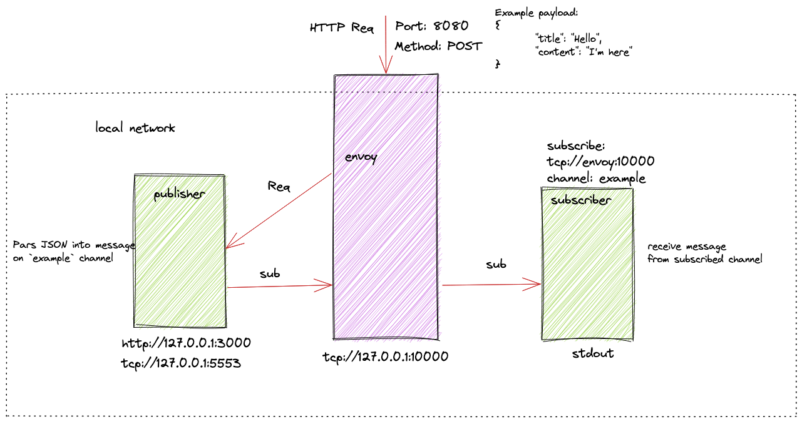

# Envy proxy with ZeroMQ

Solution tested on DigitalOcean Droplet. In case of re-creation VM follow this [article](https://blog.3sky.dev/article/cloud-init-intro/).

## Introduction

Basic [ZeroMQ](https://zeromq.org/) implementation of publisher and subscriber in Golang with [zmq4](github.com/pebbe/zmq4).
Utilize [Envoy](https://www.envoyproxy.io) as a proxy, and traffic router between components. 

## Implementation



### Aplication configuration

Both publisher and subscriber are configurable. 

#### Publisher

Application has one parameter `PUB_PORT` for setting exposed TCP port. Variable is reading from the environment. 

    ```bash
    # default setting
    PUB_PORT=5553
    ```
    
#### Subscriber

Application has two parameters `PUB_PORT` for setting publishers port, and `PUB_HOST` for setting publishers hostname resolved via DNS. Variables are reading from the environment. 

    ```bash
    # default setting
    PUB_PORT=5553
    PUB_HOST=localhost
    ```
    
### Proxy

Envoy is configurable via `envoy.yaml` file. The current setting provides two listeners(HTTP, TCP) with basic routes and access logs. TCP connection has connection timeout set for the 30s and idle_timeout for 7days.

## Demo

1. Run environment(droplet)

    ```bash
    docker-compose up
    ```
1. Open another terminal's windows(workstation)

1. Grab droplet's IP(workstation)
   
   ```bash
   export IP=$(tf output -raw public_ip)
   ```

1. Watch logs(workstation)

1. Run CURL command(workstation)

    ```bash
    curl -i --request POST   --url http://"$IP":8080/   --header 'Content-Type: application/json'   --data '{
        "title": "Hello",
        "content": "I"m here"
    }' 
    ```
